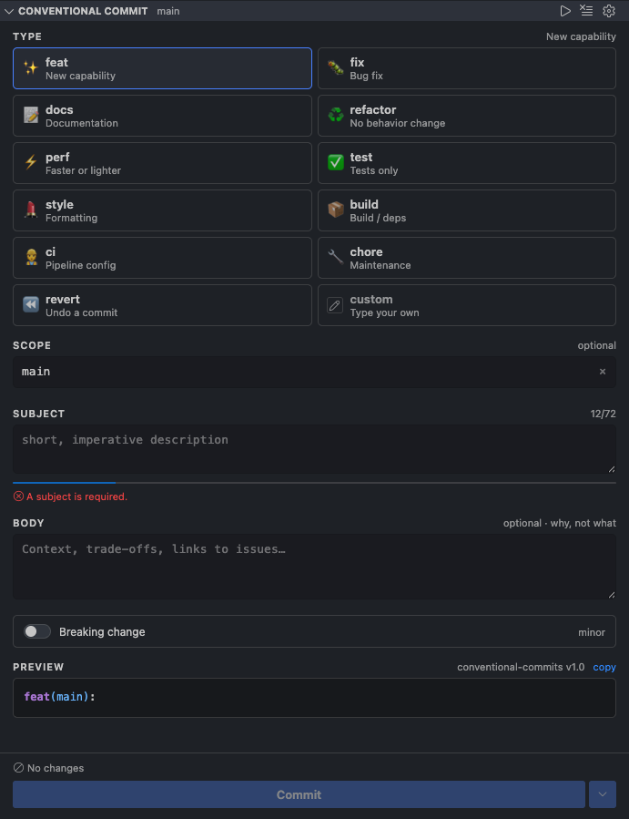

# Conventional Commit Panel

Compose [Conventional Commit](https://www.conventionalcommits.org/en/v1.0.0/) messages from a
panel that lives in the Source Control view — pick a type, scope and subject in any order, see the
message as you build it, and commit.

Existing extensions give you a one-shot modal wizard: pick the wrong type on step one and you start
over, and nothing shows you the message you are assembling. This one keeps every field on screen and
editable, with a live preview of exactly what will be committed.

## Features

**Type grid.** Every commit type as a card, with an icon and a one-line description. The last card
is a text field — type your own if the list doesn't cover it.

**Branch-aware scope.** On `feature/PROJ-123-add-login` the panel fills in `PROJ-123` for you. Switch
branches and it follows; pick a scope yourself and it stays put.

The current branch is *always* offered as a chip, whatever it is. What
`conventionalCommitPanel.scope.ignoreBranches` controls is only whether it gets filled in
automatically — on `main` or `develop` the branch name isn't an area of the codebase, and
`feat(main): …` would be noise that lives in your history forever. So it's one click away rather
than pre-filled. Set that list to `[]` if you'd rather it always fill in.

Chips also come from your repository config and from scopes you have committed with before. Typing in
the field never adds a suggestion — only an actual commit does. *Conventional Commit: Clear Recent
Scope Suggestions* empties the list.

**Live validation.** A character counter and fill meter against the header limit, with the specific
rule you're breaking named underneath. When your repo has commitlint, the rules being checked are the
ones parsed from its config.

**Live preview.** The rendered message with syntax colouring, so there are no surprises in
`git log`.

**Breaking changes.** A toggle that adds the `!` marker and the `BREAKING CHANGE:` footer, showing
the resulting release impact — `patch`, `minor` or `major`.

**Reads your existing config.** Types and scopes come from `.cz-config.js`, `.czrc`,
`package.json#config.commitizen` or a commitlint config, falling back to the standard Conventional
Commits list when there's nothing to read. It parses those files directly — nothing needs to be
installed, and it doesn't shell out to the commitizen or commitlint CLIs.

**Guided wizard.** Prefer a linear flow? The toolbar button walks the same fields step by step, with
a back button. It shares one draft with the panel, so you can switch between them freely.

**Room to work.** The panel sits in the Source Control view, which gives its sections a fixed share
of the sidebar. When that's tight, **Open Composer in Editor** puts the same composer in a full
editor tab. Both stay in sync — edit in either and the other follows.

**Publishing a branch.** Pushing a branch that has no upstream offers to publish it instead of
failing with `fatal: The current branch has no upstream branch`. It uses `origin` when there is one
and asks when there are several, and nothing reaches a remote until you press the button.

Your draft survives a window reload, and the panel never overwrites text you typed into the Source
Control box by hand.

## Settings

| Setting | Default | Description |
| --- | --- | --- |
| `conventionalCommitPanel.liveSync` | `true` | Mirror the draft into the commit box as you edit. |
| `conventionalCommitPanel.headerMaxLength` | `72` | Header limit. A commitlint `header-max-length` rule wins over this. |
| `conventionalCommitPanel.bodyLineLength` | `72` | Wrap column for the body. `0` disables wrapping. |
| `conventionalCommitPanel.useEmoji` | `false` | Prefix the subject with the type's emoji. |
| `conventionalCommitPanel.types` | `[]` | Custom type list. Empty means repo config, then the built-in list. |
| `conventionalCommitPanel.defaultType` | `feat` | Type pre-selected on a fresh draft. Empty string selects nothing. |
| `conventionalCommitPanel.scope.ticketPattern` | `([A-Z][A-Z0-9]+-\d+)` | Pulls a ticket ID out of the branch name. |
| `conventionalCommitPanel.scope.branchPrefixes` | `feature, feat, fix, …` | Prefixes stripped before the segment fallback. |
| `conventionalCommitPanel.scope.ignoreBranches` | `main, master, develop, dev, trunk` | Branches that suggest no scope. |
| `conventionalCommitPanel.scope.required` | `false` | Treat an empty scope as an error. Off by default — the spec makes scope optional. |
| `conventionalCommitPanel.showBreakingChange` | `true` | Show the breaking-change toggle. |
| `conventionalCommitPanel.showCustomType` | `true` | Show the Custom card at the end of the type grid. |
| `conventionalCommitPanel.config.allowJsConfig` | `false` | Allow executing JS configs from the repository. |
| `conventionalCommitPanel.body.useEditor` | `false` | Always edit the body in an editor tab. |

## Notes

**Nothing commits on its own.** The Commit button is the only path to a commit.

**JavaScript configs are opt-in.** `.cz-config.js` and `commitlint.config.js` are code, and loading
them means running code from the repository you just opened. That is off unless you enable
`conventionalCommitPanel.config.allowJsConfig`, is skipped entirely in untrusted workspaces, and
happens in a short-lived child process rather than inside the extension host. JSON and YAML configs
are parsed, never executed, and always read.

**No duplicate file list.** VS Code's own `Changes` section sits directly below the panel and already
does that job well.

## Contributing

Bug reports and pull requests are welcome — see [CONTRIBUTING.md](CONTRIBUTING.md) for how to build,
test and release.

## License

[MIT](LICENSE)
